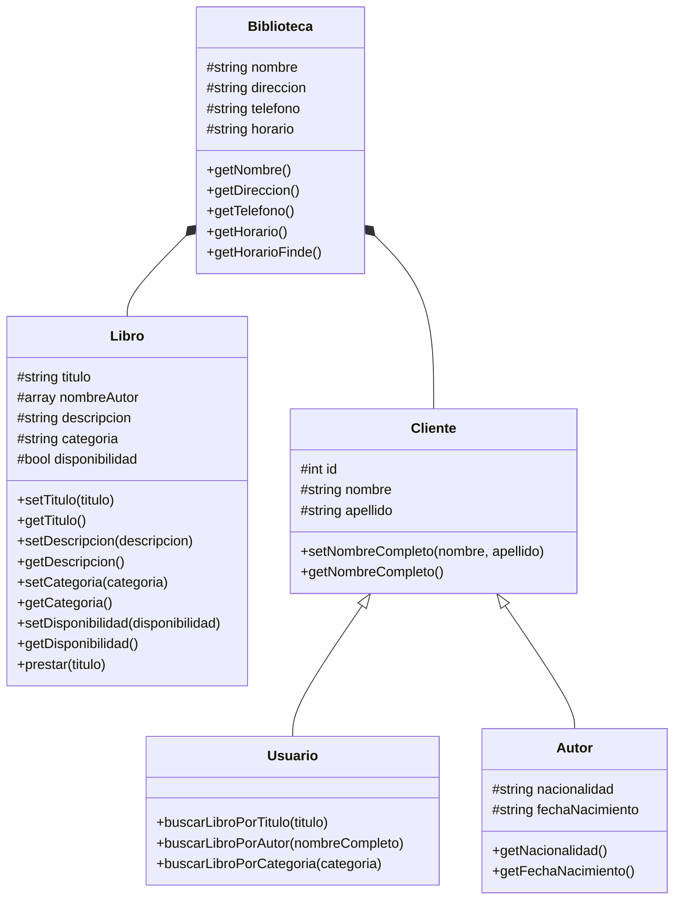

# Bibliotech
*Sistema CRUD* para gestionar libros de una biblioteca.

## Descripción del sitema
Sistema bibliotecario que de manera general permite que los libros sean agregados, buscados y eliminados. De manera específica a cada libro permite gestionar la información de los autores, las categorías y otra información relevante.

**Funcionalidades específicas del sistema**
- Los usuarios pueden buscar libros por título,a utor o categoría.
- Los usuarios pueden solicitar el préstamo de un libro y actualizar su estado a prestado.

## Diagramas de clases
- Biblioteca
- Libro
- Cliente
- Autor
- Usuario

